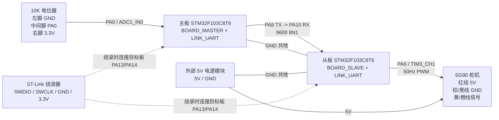

# 硬件连接图

本图对应正式 `BOARD_MASTER + LINK_UART` 必做版本。主板采集电位器角度，通过 UART 单向发送给从板；从板输出 PWM 控制 SG90 舵机。

## 接线清单

| 模块 | 引脚 | 连接到 | 说明 |
| --- | --- | --- | --- |
| 电位器 | 左脚 | 主板 `GND` | 方向相反时可交换左右脚 |
| 电位器 | 中间脚 | 主板 `PA0` | ADC 采样角度 |
| 电位器 | 右脚 | 主板 `3.3V` | 不要接 5V 到 PA0 |
| 主板 | `PA9 TX` | 从板 `PA10 RX` | UART 必做链路 |
| 主板 | `GND` | 从板 `GND` | 两块板必须共地 |
| 从板 | `PA6 / TIM3_CH1` | 舵机信号线 | 输出 0.5ms 到 2.5ms 脉宽 |
| 舵机 | 红线 | 外部 `5V` | 不建议从 ST-Link 取电 |
| 舵机 | 棕/黑线 | 外部电源 `GND` | 必须与从板 `GND` 共地 |
| ST-Link | `SWDIO/SWCLK` | 目标板 `PA13/PA14` | 烧录时连接当前目标板 |
| ST-Link | `GND/3.3V` | 目标板 `GND/3V3` | `BOOT0` 保持在 `0` 侧 |

## 调试提示

- 从板 PC13 常亮通常表示没有收到有效 UART 帧；收到主板数据后会熄灭。
- 舵机不动时，优先确认外部 5V 是否稳定，以及舵机电源 GND 是否与从板 GND 相连。
- 若 Keil 报 `No target connected` 或 `Could not stop Cortex-M device`，只保留 ST-Link 的 `3.3V/GND/SWDIO/SWCLK/NRST` 再重试。
