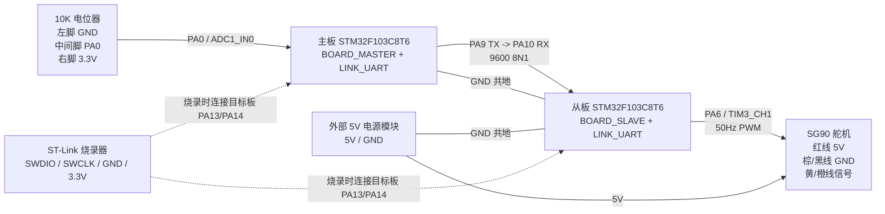

# 硬件连接图

正式配置：`BOARD_MASTER + LINK_UART` / `BOARD_SLAVE + LINK_UART`。

## 接线清单

| 模块 | 引脚 | 连接到 | 说明 |
| --- | --- | --- | --- |
| 电位器 | 左脚 | 主板 `GND` | 方向反时交换左右脚 |
| 电位器 | 中间脚 | 主板 `PA0` | ADC 输入 |
| 电位器 | 右脚 | 主板 `3.3V` | 不要接 5V 到 PA0 |
| 主板 | `PA9 TX` | 从板 `PA10 RX` | UART |
| 主板 | `GND` | 从板 `GND` | 共地 |
| 从板 | `PA6 / TIM3_CH1` | 舵机信号线 | 50Hz PWM |
| 舵机 | 红线 | 外部 `5V` | 独立供电 |
| 舵机 | 棕/黑线 | 外部电源 `GND` | 与从板共地 |
| ST-Link | `SWDIO/SWCLK` | 目标板 `PA13/PA14` | 烧录 |
| ST-Link | `GND/3.3V` | 目标板 `GND/3V3` | `BOOT0 = 0` |

## 关键提示

- 从板 PC13 常亮：未收到有效 UART 帧。
- 舵机不动：先查 `5V` 和共地。
- 烧录失败：只保留 `3.3V/GND/SWDIO/SWCLK/NRST`。
